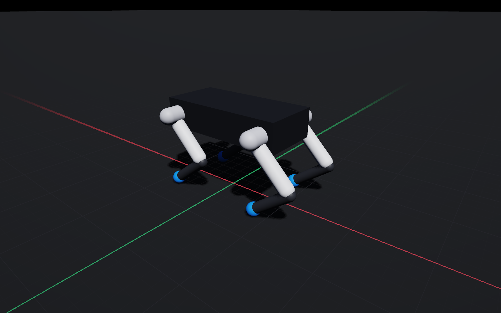
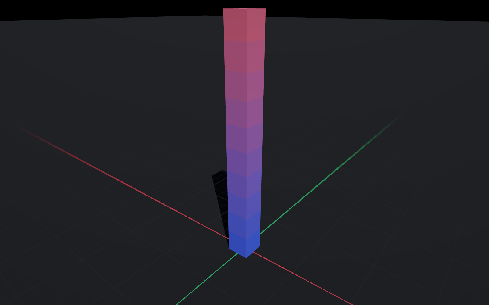

# Kinetic

<div class="kn-hero">
  
  <p class="kn-caption">A twelve-actuator quadruped holding a crouch. Rendered headless with
  <code>kinetic render quadruped</code> — same renderer the viewport uses.</p>
</div>

Kinetic is a robotics simulator built for macOS. It is one repository containing
four things that usually come from four different projects:

- a **rigid-body physics engine** in C++20 — reduced-coordinate articulated
  dynamics, convex collision detection, and a soft-constraint solver;
- a **Metal renderer** — instanced physically-based shading, shadow mapping and
  debug overlays, running on Apple GPUs with no translation layer;
- **Kinetic Studio** — a native SwiftUI application for driving, inspecting and
  scrubbing a running simulation;
- a **telemetry server** that speaks the Foxglove WebSocket protocol, so any
  Foxglove client can visualise a Kinetic scene without a bridge process.

Everything is native. There is no Python runtime, no ROS installation, no
container, no CUDA. `swift build` produces the whole system in under a minute
and the result is a single Mach-O binary plus an app bundle.

```bash
git clone https://github.com/shubhxho/kinetic
cd kinetic
swift build -c release
./.build/release/kinetic validate
```

## Where to go

<div class="kn-cards">
  <a class="kn-card" href="getting-started/install.html">
    <h3>Install and run</h3>
    <p>Build from source, verify the engine, bundle the app, put the CLI on your
    PATH.</p>
  </a>
  <a class="kn-card" href="getting-started/first-simulation.html">
    <h3>Your first simulation</h3>
    <p>A ball, an arm, a real URDF — and how to read results back out.</p>
  </a>
  <a class="kn-card" href="physics/dynamics.html">
    <h3>How the physics works</h3>
    <p>The actual algorithms, with the equations they implement and why each
    choice was made.</p>
  </a>
  <a class="kn-card" href="cookbook.html">
    <h3>Cookbook</h3>
    <p>Control loops, teleoperation, parameter sweeps, CI regression images,
    resolved-rate control.</p>
  </a>
  <a class="kn-card" href="reference/benchmarks.html">
    <h3>Benchmarks</h3>
    <p>Measured numbers, where the time goes, and what the last rewrite
    changed.</p>
  </a>
  <a class="kn-card" href="reference/comparison.html">
    <h3>How it compares</h3>
    <p>Against Isaac, MuJoCo, Bullet, Gazebo and Foxglove — including where each
    of them wins.</p>
  </a>
</div>

## What it is for

Kinetic is aimed at the loop you actually spend time in: change a model or a
controller, watch what happens, work out why it happened.

That means the parts most simulators treat as afterthoughts are first-class
here. Contact forces are drawn as arrows, not hidden in a log. The solver
publishes its own residual and iteration count as a plottable channel. The
timeline holds the last twenty seconds of full simulation state, so when
something goes wrong you drag backwards into it rather than restarting with more
print statements.

## What it is not

- **Not a GPU-parallel training farm.** Isaac Sim and Isaac Lab exist to run
  thousands of environments at once on NVIDIA hardware. Kinetic runs one world
  extremely well on the machine you are sitting at. If your bottleneck is
  reinforcement-learning throughput, this is the wrong tool.
- **Not a photorealistic renderer.** The viewport is a real PBR renderer with
  shadows and tone mapping, but it is built to make *physics* legible, not to
  produce marketing footage.
- **Not cross-platform.** The physics core is portable C++ with no dependencies,
  but the renderer is Metal and the app is AppKit and SwiftUI.

## A tour in one page

```swift
import Kinetic

let world = World()
world.addGround(friction: 1.0)

for i in 0..<10 {
    world.addRigidBody(
        name: "box\(i)",
        shape: .box(halfExtents: Vec3(0.1, 0.1, 0.1)),
        density: 500,
        pose: Pose(position: Vec3(0, 0, 0.1 + 0.2005 * Double(i))))
}
world.compile()

world.step(3000)                     // six seconds at the default 500 Hz
print(world.contacts().count)        // 40 contact points holding the tower up
print(world.centerOfMass)            // SIMD3<Double>(0.0, 0.0, 1.0)
```

<div class="kn-figure">
  
  <p class="kn-caption">The scene above after 400 steps. Every box is within 7 mm
  of its ideal height — the load propagates through nine box-on-box manifolds
  and forty contact points.</p>
</div>

The same model can be loaded from URDF or MJCF, streamed to Foxglove, recorded
to a seekable `.kinlog`, rendered headless to a PNG, or opened in Studio.

## The system, in one diagram

<div class="kn-figure">
<svg viewBox="0 0 720 300" role="img" aria-label="Kinetic layer diagram" class="kn-svg">
  <style>
    .kn-svg .box { fill: none; stroke: currentColor; stroke-width: 1.2; opacity: 0.55; }
    .kn-svg .fill { fill: currentColor; opacity: 0.05; }
    .kn-svg .label { fill: currentColor; font: 600 13px ui-sans-serif, system-ui, sans-serif; }
    .kn-svg .sub { fill: currentColor; font: 400 11px ui-monospace, SFMono-Regular, monospace; opacity: 0.6; }
    .kn-svg .accent { stroke: #0070f3; stroke-width: 1.6; opacity: 1; }
    .kn-svg .accentText { fill: #0070f3; font: 600 13px ui-sans-serif, system-ui, sans-serif; }
    .kn-svg .arrow { stroke: currentColor; stroke-width: 1; opacity: 0.35; }
  </style>

  <rect class="fill" x="20" y="16" width="680" height="44" rx="8"/>
  <rect class="box" x="20" y="16" width="680" height="44" rx="8"/>
  <text class="label" x="40" y="36">KineticStudio</text>
  <text class="sub" x="40" y="52">SwiftUI app · viewport · timeline over full state · plots · command palette</text>

  <rect class="fill" x="20" y="72" width="332" height="44" rx="8"/>
  <rect class="box" x="20" y="72" width="332" height="44" rx="8"/>
  <text class="label" x="40" y="92">KineticRender</text>
  <text class="sub" x="40" y="108">Metal PBR · shadows · overlays</text>

  <rect class="fill" x="368" y="72" width="332" height="44" rx="8"/>
  <rect class="box" x="368" y="72" width="332" height="44" rx="8"/>
  <text class="label" x="388" y="92">KineticBridge</text>
  <text class="sub" x="388" y="108">RFC 6455 · foxglove.websocket.v1</text>

  <rect class="fill" x="20" y="128" width="680" height="44" rx="8"/>
  <rect class="box" x="20" y="128" width="680" height="44" rx="8"/>
  <text class="label" x="40" y="148">Kinetic</text>
  <text class="sub" x="40" y="164">Swift API · URDF · MJCF · meshes · Quickhull · .kinlog recording</text>

  <rect x="20" y="184" width="680" height="40" rx="8" fill="#0070f3" opacity="0.07"/>
  <rect class="box accent" x="20" y="184" width="680" height="40" rx="8"/>
  <text class="accentText" x="40" y="203">kinetic.h</text>
  <text class="sub" x="40" y="218">stable C ABI · ~90 entry points · plain data, opaque handles</text>

  <rect class="fill" x="20" y="236" width="680" height="44" rx="8"/>
  <rect class="box" x="20" y="236" width="680" height="44" rx="8"/>
  <text class="label" x="40" y="256">KineticCore</text>
  <text class="sub" x="40" y="272">C++20 physics · CRBA · RNEA · GJK/EPA · PGS solver · no dependencies</text>

  <line class="arrow" x1="360" y1="60" x2="360" y2="72"/>
  <line class="arrow" x1="360" y1="116" x2="360" y2="128"/>
  <line class="arrow" x1="360" y1="172" x2="360" y2="184"/>
  <line class="arrow" x1="360" y1="224" x2="360" y2="236"/>
</svg>
  <p class="kn-caption">Each layer depends only on the one below it, and each can
  be used without the ones above. Linking <code>Kinetic</code> alone gives a headless
  engine with no GUI dependency.</p>
</div>

## How the book is organised

| Part | What it covers |
| --- | --- |
| [Getting started](./getting-started/install.md) | Building, the first simulation, Studio and the CLI |
| [Concepts](./concepts/architecture.md) | How the pieces fit, and the conventions everything obeys |
| [Physics](./physics/dynamics.md) | The actual algorithms, with the equations they implement |
| [Cookbook](./cookbook.md) | Complete, runnable recipes for common tasks |
| [Formats](./formats/urdf.md) | What Kinetic reads and writes, and where the edges are |
| [Telemetry](./telemetry/foxglove.md) | Streaming a live simulation to external tools |
| [API reference](./api/swift.md) | The Swift and C surfaces |
| [Reference](./reference/benchmarks.md) | Measured numbers, comparisons, shortcuts, glossary |

If you want to understand the engine rather than use it, start at
[Rigid-body dynamics](./physics/dynamics.md) — it explains the coordinate
choice that everything else follows from.

## Status

Version 1.0. The physics core is validated against closed-form solutions and
conservation laws on every commit; see
[Accuracy and validation](./physics/accuracy.md) for the current numbers and
exactly what each check proves.
