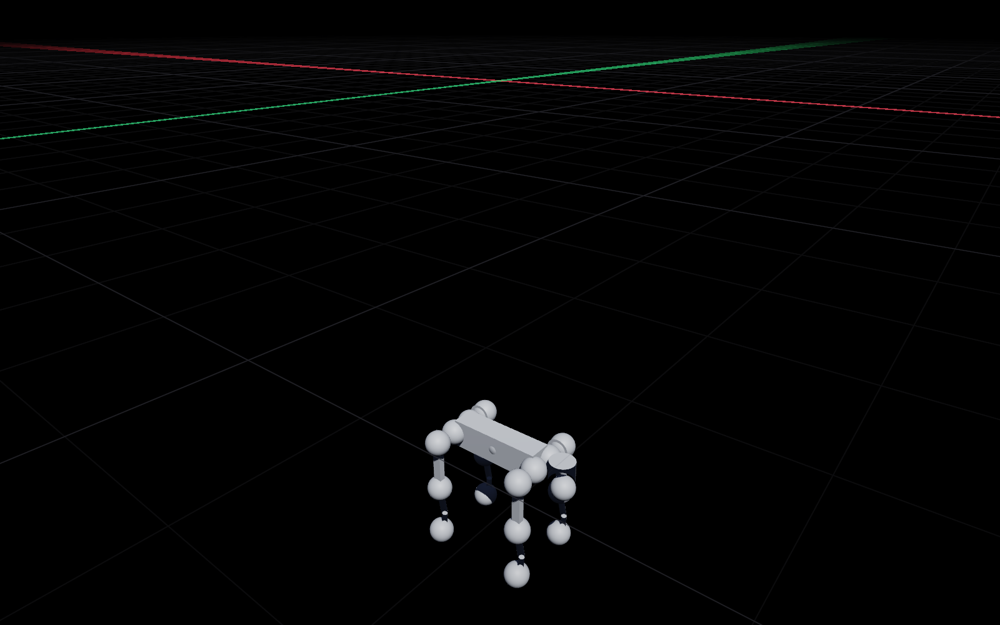

# The model library

Kinetic ships a registry of published robot descriptions. Every entry's upstream
URL was fetched and confirmed before it was recorded, licences are surfaced
rather than assumed, and **nothing is re-hosted** — models are downloaded from
their own repositories into a local cache.

```bash
kinetic models list
kinetic models info unitree-go2
kinetic models fetch unitree-go2
kinetic models validate unitree-go2
```

## The registry

| id | vendor | format | dof | actuators | licence |
| --- | --- | --- | --- | --- | --- |
| `franka-panda` | Franka Emika | MJCF | 9 | 8 | Apache-2.0 |
| `franka-fr3` | Franka Robotics | MJCF | 7 | 7 | Apache-2.0 |
| `ur5e` | Universal Robots | MJCF | 6 | 6 | BSD-3-Clause |
| `ur10e` | Universal Robots | MJCF | 6 | 6 | BSD-3-Clause |
| `robotiq-2f85` | Robotiq | MJCF | 8 | 1 | BSD-2-Clause |
| `shadow-hand` | Shadow Robot | MJCF | 24 | 20 | Apache-2.0 |
| `unitree-go1` | Unitree | MJCF | 12 | 12 | BSD-3-Clause |
| `unitree-go2` | Unitree | MJCF | 12 | 12 | BSD-3-Clause |
| `anymal-c` | ANYbotics | MJCF | 12 | 12 | BSD-3-Clause |
| `unitree-h1` | Unitree | MJCF | 19 | 19 | BSD-3-Clause |
| `unitree-g1` | Unitree | MJCF | 29 | 29 | BSD-3-Clause |
| `nvidia-franka-panda-urdf` | NVIDIA | URDF | 9 | 9 | Apache-2.0 |
| `nvidia-allegro-hand` | Wonik Robotics | URDF | 16 | 16 | BSD-3-Clause |
| `nvidia-kuka-allegro` | NVIDIA | URDF | 23 | 23 | BSD-3-Clause |

Sources: [MuJoCo Menagerie](https://github.com/google-deepmind/mujoco_menagerie)
and [IsaacGymEnvs](https://github.com/isaac-sim/IsaacGymEnvs).

Degree-of-freedom and actuator counts were parsed from the actual XML rather
than quoted from documentation, which corrected several inflated numbers that
had counted `<default>`-block declarations.

<div class="kn-figure">
  
  <p class="kn-caption">A Unitree Go2 fetched with <code>kinetic models fetch unitree-go2</code>:
  14 links, 18 degrees of freedom, 12 actuators, 15.206 kg, simulating at 126×
  realtime.</p>
</div>

## Fetching

```swift
let library = ModelLibrary()
let url = try await library.fetch("franka-panda") { fraction in
    print("\(Int(fraction * 100))%")
}
let (world, robot) = try library.load("franka-panda")
```

The fetch is **sparse**: one GitHub tree listing, then only the blobs under the
entry's own subtree. Menagerie is 1.9 GB checked in; `franka-panda` pulls 37 MB
and `nvidia-franka-panda-urdf` pulls 320 KB. It falls back to the repository
archive when the listing is truncated, and honours `GITHUB_TOKEN` when set.

Downloads land in a staging directory and are promoted into the cache only after
the description file is present, non-empty, and parses with the right root
element — so a 404 page or a rate-limit body can never be cached as a robot.

`load` never opens a socket. A cached model works offline.

## Validating before you trust it

```bash
kinetic models validate unitree-go2
```

```text
Unitree Go2  Unitree Robotics · BSD-3-Clause

  links             14
  degrees of freedom 18  (registry declares 12 excluding the base)
  actuators         12
  geoms             56
  total mass        15.206 kg
  base              floating

  2 warning(s)
    · 13 movable joint(s) have no position limits (base, FL_hip, FL_thigh, FL_calf).
      Correct for continuous wrists and wheels; everywhere else it lets a
      controller wind the joint past its physical stop.
    · registry caveats for 'unitree-go2': …
```

`ModelValidation` reports link, dof, actuator and geom counts, total mass,
zero-mass and implausible-mass links, unlimited joints, unresolved mesh
references, the base type, and the licence — as data, so the CLI and the app
render the same report.

## Known caveats, stated up front

These are real limitations found by importing the models, not hypotheticals.

- **`<equality>` and `<tendon>` are not read.** `robotiq-2f85` therefore imports
  as eight free-swinging hinges — usable as geometry, not for grasp force — and
  the Panda and Shadow Hand couplings are lost.
- **COLLADA meshes are rejected**, not approximated. The NVIDIA Panda entry
  fetches only its collision OBJs for that reason; its visual `.dae` files do not
  load.
- **ANYmal C's IsaacGymEnvs URDF was dropped** from the registry entirely: all 45
  of its mesh references are COLLADA, so it would have imported with no geometry
  at all. The MJCF version is the entry.
- **Isaac Sim's own robot assets are USD**, served from a Nucleus server, and are
  not URDF or MJCF. They are not faked as registry entries; the exact USD paths
  are cited in the relevant entries' notes so you can find them, and
  [USD import](./formats/usd.md) covers what Kinetic can do with them.
- **NVlabs/cuRobo assets were dropped** — the paths 404; the assets are not in
  that repository.

## Cache

```bash
kinetic models cache        # what is downloaded and how big
kinetic models purge <id>   # remove one
kinetic models purge        # remove everything
```

The cache lives at `~/Library/Application Support/Kinetic/Models/`.
